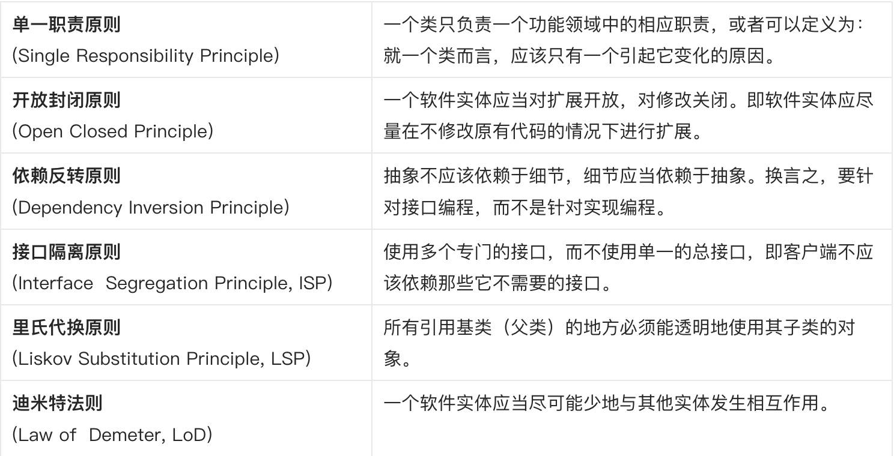
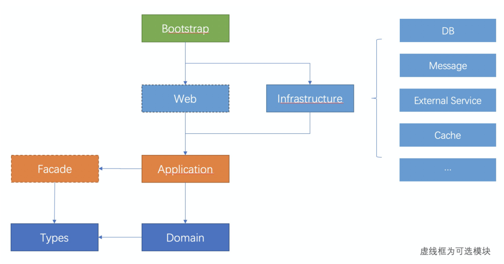
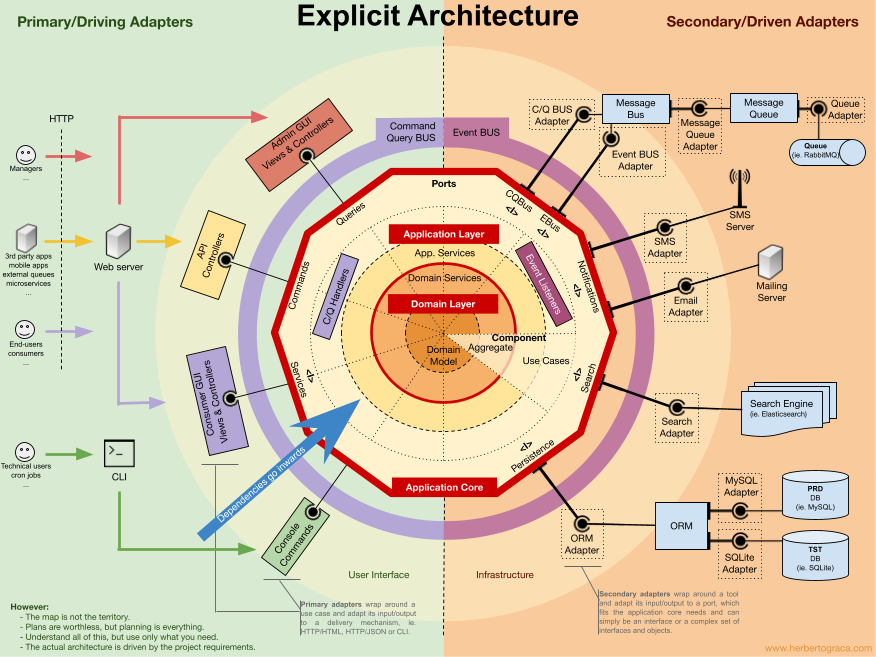

# 背景
我们经常会面对这样的情况：自己所开发维护的系统，遍地都是面条代码，一个方法上千行，根本无法维护。每天面对 shit 一样的代码，痛不欲生。

导致开发同学普遍有这样的困惑：怎么避免写这种流水账代码？纯业务开发同学技术上如何成长？
架构师同样也困惑：在开发中如何降低软件、系统复杂度？

DDD（领域驱动设计）就能药到病除，它真正从业务的角度出发，为做纯业务的开发提供了一整套的架构思路。

由于 DDD 不是一套框架，而是一种架构思想，所以在代码层面缺乏了足够的约束，导致 DDD 在实际应用中上手门槛很高，甚至可以说绝大部分人都对 DDD 的理解有所偏差。
**所以，这里我们约定一套认为合理的代码结构、框架和约束，来降低 DDD 的实践门槛，提升代码质量、可测试性、安全性、健壮性**。

# 设计原则
DDD 开发规约的底层原则，其实就是我们常见的六大软件设计原则。理解底层原则非常重要，这决定我们对一个架构设计能吸收多少。
平常在设计接口、组件或编码使用设计模式时也都应当遵循。六大设计原则：

# 应用分层与依赖关系
本应用采用 DDD 分层 —— 基于领域驱动设计思想设计的分层结构，在 DDD 的经典四层分层架构之上进行了改良，
采用依赖倒置的方式解决领域层与基础设施层的相互依赖问题，使其更加符合经典的六边形架构。

应用分层以及依赖关系如下：

这样的依赖关系带来的好处是：我们可能先写 Domain 层的业务逻辑，然后再写 Application 层的组件编排，最后才写每个外部依赖的具体实现。
这种架构思路和代码组织结构就叫做 Domain-Driven Design（领域驱动设计，或 DDD）。

# 分层详细说明
### bootstrap 模块（启动层）
启动模块，该模块中包含应用的启动类、配置文件、打包插件等。该层通过直接或间接依赖，引用了其他各模块的代码。该模块的测试目录中提供了集成测试的基类，供开发人员继承或扩展。

### web 模块（展现层）
web 层是应用的视图展现层，该层是可选的，如果不需要提供 web 服务，可以去掉这一层，此时 bootstrap 直接依赖 application 层。web 层被 bootstrap 层依赖，依赖 application 层实现具体的业务逻辑。

### infrastructure 模块（基础设施层）
infrastructure 层为系统提供了各类基础设施，包含了 RPC、Message、DB、Cache 等三方系统的依赖，流程引擎、规则引擎等 service 层可能用到的编排工具。

infrastructure 层依赖 application & domain 层，它不被 application & domain 层直接依赖，通过依赖反转的方式提供 application & domain 层中服务（service）的具体实现。

### facade 模块（外观层）
facade 层是应用对外提供的接口层。该层是可选的，如果不需要对外提供服务，可以去掉这一层。facade 层用于提供接口描述文件(service，DTO)，不包含任何业务逻辑。该模块使用单独的版本号，需要单独发布打包。

### application 模块（应用层）
application 层相当于领域驱动设计中的应用层，位于领域层之上，调用领域服务，使用领域模型，更专注于具体应用所需要的逻辑处理，而不包含核心业务规则，更多的是给领域层需要协作的各个领域服务协调任务、委派工作。

当存在 facade 层时，application 层依赖 facade 层，提供 facade 层接口的具体实现逻辑。

### domain 模块（核心领域层）
domain 层相当于领域驱动设计中的领域层，定义了领域模型，同时使用领域模型提供了核心领域服务 (以 service 结尾命名)。领域层是业务的核心，仅依赖 types 模块，保证核心系统对外部系统的解耦。

若需在 domain 层查询数据库或者其他第三方服务（数据库和第三方服务是在 Infrastructure 层的），写代码时可以在 domain 层定义一个接口（若使用了外部服务防腐层则在防腐层中定义），在 infrastructure 层去实现，在 domain 层直接依赖接口即可注入实现类。

### types 模块 （公共类型模块）
types 模块是保存可以对外暴露的 Domain Primitives、共用的常量、枚举的地方。这些是无状态的逻辑，可以对外暴露，所以经常被包含在对外的 API 接口中，因此需要单独成为模块。
types 模块不依赖任何类库，纯 POJO。

# 设计与代码规范
## 模型对象代码规范
### 3种对象模型规范
Entity、Data Object (DO) 和 Data Transfer Object (DTO) 3种模型的区别：

- Data Object （DO、数据对象）： 数据模型。在DDD的规范里，DO应该仅仅作为数据库物理表格的映射，不能参与到业务逻辑中。为了简单明了，DO 的字段类型和名称应该和数据库物理表格的字段类型和名称一一对应，这样我们不需要去跑到数据库上去查一个字段的类型和名称。

- Entity（实体对象）：实体对象是我们正常业务应该用的业务模型，它的字段和方法应该和业务语言保持一致，和持久化方式无关。也就是说，Entity 和 DO 很可能有着完全不一样的字段命名和字段类型，甚至嵌套关系。Entity 的生命周期应该仅存在于内存中，不需要可序列化和可持久化。

- DTO（传输对象）：主要作为 Application 层的入参和出参，比如 CQRS 里的 Command、Query、Event，以及 Request、Response 等都属于 DTO 的范畴。DTO 的价值在于适配不同的业务场景的入参和出参，避免让业务对象变成一个万能大对象。

### 实体（Entity）
大多数 DDD 架构的核心都是实体类，实体类包含了一个领域里的状态、以及对状态的直接操作。Entity 最重要的设计原则是保证实体的不变性（Invariants），也就是说要确保无论外部怎么操作，一个实体内部的属性都不能出现相互冲突，状态不一致的情况。

- 定义唯一标识

实体与聚合根都必须具有唯一的标识。

- 创建即一致

在贫血模型里，通常见到的代码是一个模型通过手动 new 出来之后，由调用方一个参数一个参数的赋值，这就很容易产生遗漏，导致实体状态不一致。

所以 DDD 里实体创建的方法有两种：
[√]  constructor 参数要包含所有必要属性，或者在 constructor 里有合理的默认值；
[√]  使用 Factory 模式来降低调用方复杂度；

### 值对象（Value Object）、DP（Domain Primitive）
在 DDD 中，Value Object 这个概念已经存在：
- 在 Evans 的 DDD 蓝皮书中，Value Object 更多的是一个非 Entity 的值对象，没有唯一标识。
- 在 Vernon 的 IDDD 红皮书中，作者更多的关注了 Value Object 的 Immutability、Equals 方法、Factory 方法等。

Domain Primitive 是一个在特定领域里，拥有精准定义的、可自我验证的、拥有行为的 Value Object。就好像Integer、String 是所有编程语言的 Primitive 一样，在DDD里，DP 可以说是一切模型、方法、架构的基础，而就像 Integer、String 一样，DP又是无所不在的。

Domain Primitive 是 Value Object 的进阶版，在原始  Value Object  的基础上要求每个DP拥有概念的整体，而不仅仅是值对象。在  Value Object  的 Immutable 基础上增加了有效性验证和行为。当然同样的要求无副作用（side-effect free）。

### 存储库（Repository）
传统 Data Mapper（DAO）属于“固件”，属于基础设施层。和底层实现（DB、Cache、文件系统等）强绑定，如果直接使用会导致代码“固化”。所以为了在 Repository 的设计上体现出“软件”的特性，主要需要注意以下三点。

- 接口名称不使用底层实现的语法
- 出参入参不应该使用底层数据格式
- 应该避免所谓的“通用” Repository 模式

###  领域服务（Domain Service）
定义：当领域中的某个操作过程或转换过程不是实体或值对象的职责时，此时我们便应该将该操作放在一个单独的接口中，即领域服务 Domain Service。

### 应用服务（Application Service）
ApplicationService 负责了业务流程的编排，是将原有业务流水账代码剥离了校验逻辑、领域计算、持久化等逻辑之后剩余的流程，是“胶水层”代码。

应用服务负责和如下逻辑进行协作，包括：
- 错误处理
- 统一日志 & 监控
- 事务
- 并发控制、加锁
- 认证与授权
- 通知（邮箱、短信）
- 事件消息

# 拓展知识：六边形架构

六边形架构（也叫端口和适配器架构）的思想是将输入和输出都放在设计的边缘部分。不管我们公开的是 REST 还是 OpenAPI，也不管我们从何处获取数据 —— 是通过数据库、通过 RPC 还是 REST API，或者仅仅是一个简单的 CSV 文件，这些都不应该影响应用的业务逻辑。

这种模式让我们能将应用程序的核心逻辑与外部的关注点隔离开来。核心逻辑隔离后，我们不用关注外部实现细节，比如：我们可以轻松更改数据源的细节，而不会造成重大影响或需要在代码库重写大量代码。